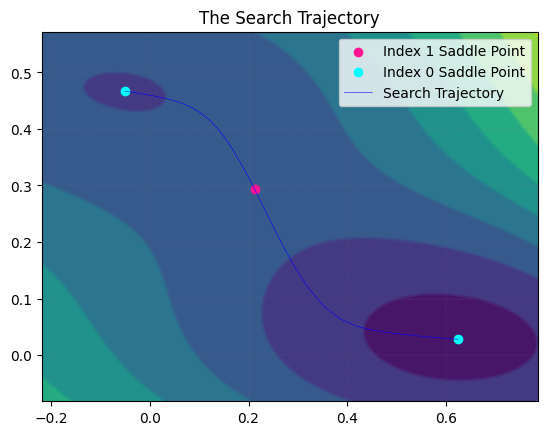
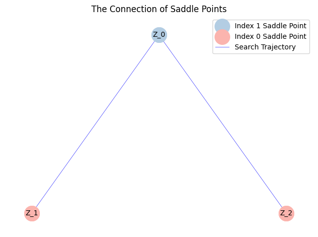
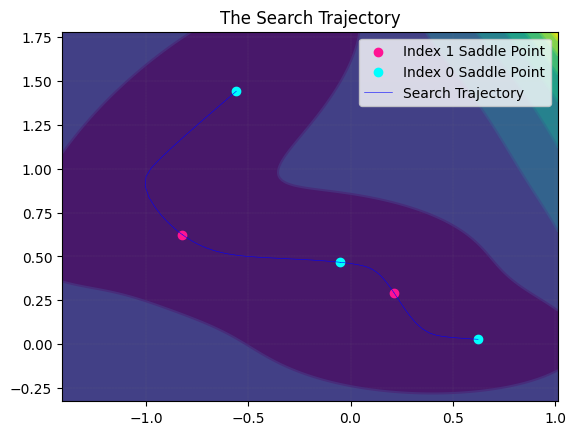
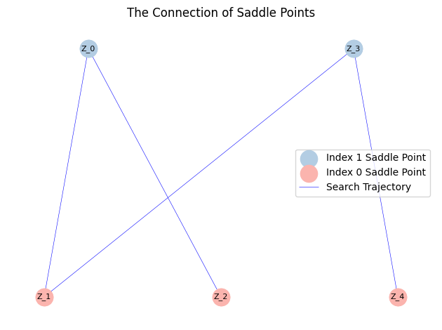

We test the M&uuml;ller-Brown potential given by 

$$
\begin{aligned}
E_{MB}(x,y)=\sum_{i=1}^{4}A_{i}\exp [a_{i}(x-\bar{x}_{i})^{2}+b_{i}(x-\bar{x}_{i})(y-\bar{y}_{i})+c_{i}(y-\bar{y}_{i})^{2}].
\end{aligned}
$$

We set the parameters as

$$
\begin{aligned}
A &= [-200,-100,-170,15], \\
a &= [-1,-1,-6.5,0.7], b=[0,0,11,0.6], c=[-10,-10,-6.5,0.7], \\
\bar{x} &= [1,0,-0.5,-1], \bar{y}=[0,0.5,1.5,1].
\end{aligned}
$$

First, we add the path of the `saddlescape-1.0` directory to the system path.


```python
import sys
import os

sys.path.append(os.path.abspath(os.path.join(os.getcwd(), '..', 'saddlescape-1.0')))

```

Then, we import the main class.


```python
from saddlescape import Landscape
import numpy as np

# import packages needed
```

We define the energy function.


```python
MBP_energyfunc='-200*exp(-1*(x1-1)**2-10*(x2-0)**2)-100*exp(-1*(x1-0)**2-10*(x2-0.5)**2)-170*exp(-6.5*(x1+0.5)**2' \
'+11*(x1+0.5)*(x2-1.5)-6.5*(x2-1.5)**2)+15*exp(0.7*(x1+1)**2+0.6*(x1+1)*(x2-1)+0.7*(x2-1)**2)'
```


We initialize the solver and run it.


```python
# parameter initialization
x0 = np.array([0.15, 0.25]) # initial point
dt = 4e-4 # time step
k = 1 # the maximum index of saddle point
acceme = 'none' # use the heavy ball to accelerate
maxiter = 5000 # max iter
```

As an example of user-defined temporal discretization, we apply a second-order explicit Adams update to the $x$-equation while retaining the default eigenspace update.

```python
def adams_bashforth_2nd_for_x(instance, xlist, vlist, glist, dt, j):
    x_n = copy.deepcopy(xlist[-1])
    g_n = copy.deepcopy(glist[-1])
    if vlist is not None:
      # ================== index-k (k>=1) ==================
        v_n = copy.deepcopy(vlist[-1])
        phi_n = g_n - 2.0 * np.matmul(v_n, np.matmul(v_n.T, g_n))
        if j == 1 or len(glist) < 2:
            dx = dt * phi_n
        else:
            v_prev = copy.deepcopy(vlist[-2])
            g_prev = copy.deepcopy(glist[-2])
            phi_prev = g_prev - 2.0 * np.matmul(v_prev, np.matmul(v_prev.T, g_prev))
            dx = dt * (1.5 * phi_n - 0.5 * phi_prev)
        x_next = x_n - dx
        v_next, whetherkindex = instance.EigVecMethod(x_next, v_n)
        return x_next, v_next, whetherkindex
    else:
        # ================== index-0 ==================
        if j == 1 or len(glist) < 2:
            dx = dt * g_n
        else:
            # Second-order explicit Adams-Bashforth scheme for x
            g_prev = glist[-2]
            dx = dt * (1.5 * g_n - 0.5 * g_prev)
        x_next = x_n - dx
        return x_next
```

Due to the steepness of the energy function, using multi-step methods based on historical gradients may introduce larger errors and reduce search efficiency. This example is solely intended to demonstrate how to use a custom scheme. Nevertheless, the final search trajectories and landscapes obtained by both methods are essentially identical. Here we present only the results from the user-defined version. (Detailed results: default scheme result [Ex_2_MullerBrownPotential](https://github.com/HiSDpackage/saddlescape/blob/main/gallery/Ex_2_MullerBrownPotential.ipynb); user-defined scheme result [Ex_2_MullerBrownPotential-Adams2nd.ipynb](https://github.com/HiSDpackage/saddlescape/blob/main/gallery/Ex_2_MullerBrownPotential-Adams2nd.ipynb))

```python
MyLandscape = Landscape(MaxIndex=k, AutoDiff=True, ExactHessian=True, EnergyFunction=MBP_energyfunc, 
                        InitialPoint=x0, TimeStep=dt, Acceleration=acceme,
                        EigenStepSize=1e-7, MaxIter=maxiter,EigenMethod='euler', Verbose=True, ReportInterval=100)
# Instantiation
MyLandscape.Run()
# Calculate
```

    HiSD Solver Configuration:
    ------------------------------
    [HiSD] Current parameters (initialized):
    [Config Sync] `Dim` parameter auto-adjusted to 2 based on `InitialPoint` dimensionality.
    Parameter `NumericalGrad` not specified - using default value False.
    Parameter `Momentum` not specified - using default value 0.0.
    Parameter `DimerLength` not specified - using default value 1e-05.
    Parameter `Tolerance` not specified - using default value 1e-06.
    Parameter `NesterovChoice` not specified - using default value 1.
    Parameter `SearchArea` not specified - using default value 1000.0.
    Parameter `NesterovRestart` not specified - using default value None.
    Parameter `EigenMaxIter` not specified - using default value 10.
    Parameter `HessianDimerLength` not specified - using default value 1e-05.
    Parameter `PrecisionTol` not specified - using default value 1e-05.
    Parameter `EigvecUnified` not specified - using default value False.
    Parameter 'GradientSystem' not provided. Enabling automatic symmetry detection.
    Parameter 'SymmetryCheck' not provided. Defaulting to True with automatic detection if available.
    
    
    Gradient system detected. Activating HiSD algorithm.
    
    
    Landscape Configuration:
    ------------------------------
    [Landscape] Current parameters (initialized):
    Parameter `SameJudgementMethod` not specified - using default value <function LandscapeCheckParam.<locals>.<lambda> at 0x0000026E5D1DD480>.
    Parameter `PerturbationMethod` not specified - using default value uniform.
    Parameter `PerturbationRadius` not specified - using default value 0.0001.
    Parameter `InitialEigenVectors` not specified - using default value None.
    Parameter `PerturbationNumber` not specified - using default value 2.
    Parameter `SaveTrajectory` not specified - using default value True.
    Parameter `MaxIndexGap` not specified - using default value 1.
    Parameter `EigenCombination` not specified - using default value all.
    
    Start running:
    ------------------------------
    
    
    
    From initial point search index-1:
    ------------------------------
    
    
    Iteration: 100|| Norm of gradient: 0.244166
    Iteration: 200|| Norm of gradient: 0.001484
    Iteration: 300|| Norm of gradient: 0.000009
    Non-degenerate saddle point identified: Morse index =1 (number of negative eigenvalues).
    
    
    From saddle point (index-1, ID-0) search index-0:
    ------------------------------
    
    
    Iteration: 100|| Norm of gradient: 42.551369
    Iteration: 200|| Norm of gradient: 5.900040
    Iteration: 300|| Norm of gradient: 0.644674
    Iteration: 400|| Norm of gradient: 0.070684
    Iteration: 500|| Norm of gradient: 0.007754
    Iteration: 600|| Norm of gradient: 0.000851
    Iteration: 700|| Norm of gradient: 0.000093
    Iteration: 800|| Norm of gradient: 0.000010
    Iteration: 900|| Norm of gradient: 0.000001
    Non-degenerate saddle point identified: Morse index =0 (number of negative eigenvalues).
    
    
    From saddle point (index-1, ID-0) search index-0:
    ------------------------------
    
    
    Iteration: 100|| Norm of gradient: 112.301955
    Iteration: 200|| Norm of gradient: 1.454184
    Iteration: 300|| Norm of gradient: 0.006413
    Iteration: 400|| Norm of gradient: 0.000028
    Non-degenerate saddle point identified: Morse index =0 (number of negative eigenvalues).
    
    
    From saddle point (index-1, ID-0) search index-0:
    ------------------------------
    
    
    Iteration: 100|| Norm of gradient: 112.301955
    Iteration: 200|| Norm of gradient: 1.454184
    Iteration: 300|| Norm of gradient: 0.006413
    Iteration: 400|| Norm of gradient: 0.000028
    Non-degenerate saddle point identified: Morse index =0 (number of negative eigenvalues).
    
    
    From saddle point (index-1, ID-0) search index-0:
    ------------------------------
    
    
    Iteration: 100|| Norm of gradient: 42.551369
    Iteration: 200|| Norm of gradient: 5.900040
    Iteration: 300|| Norm of gradient: 0.644674
    Iteration: 400|| Norm of gradient: 0.070684
    Iteration: 500|| Norm of gradient: 0.007754
    Iteration: 600|| Norm of gradient: 0.000851
    Iteration: 700|| Norm of gradient: 0.000093
    Iteration: 800|| Norm of gradient: 0.000010
    Iteration: 900|| Norm of gradient: 0.000001
    Non-degenerate saddle point identified: Morse index =0 (number of negative eigenvalues).
    
We draw the search trajectory.

```python
MyLandscape.DrawTrajectory(ContourGridNum=100, ContourGridOut=25, DetailedTraj=True)
# Draw the search path. But because of the large dimension, we cannot draw the picture.
```


    

    


We can also draw the solution landscape.


```python
MyLandscape.DrawConnection()
```


    

    


However, the M&uuml;ller-Brown Potential  describes a typical system with a multimodal distribution. The solution landscape shown above is therefore incomplete. Then, we restarted the search from a local minimum:


```python
MyLandscape.RestartFromSaddle(1,np.array([[-0.01],[0]]),1)
# Calculate
```

    
    
    From initial point search index-1:
    ------------------------------
    
    
    Iteration: 100|| Norm of gradient: 19.312756
    Iteration: 200|| Norm of gradient: 73.350020
    Iteration: 300|| Norm of gradient: 5.393141
    Iteration: 400|| Norm of gradient: 0.296593
    Iteration: 500|| Norm of gradient: 0.007024
    Iteration: 600|| Norm of gradient: 0.000128
    Iteration: 700|| Norm of gradient: 0.000001
    Non-degenerate saddle point identified: Morse index =1 (number of negative eigenvalues).
    
    
    From saddle point (index-1, ID-3) search index-0:
    ------------------------------
    
    
    Iteration: 100|| Norm of gradient: 173.689102
    Iteration: 200|| Norm of gradient: 11.176428
    Iteration: 300|| Norm of gradient: 0.189779
    Iteration: 400|| Norm of gradient: 0.003139
    Iteration: 500|| Norm of gradient: 0.000052
    Non-degenerate saddle point identified: Morse index =0 (number of negative eigenvalues).
    
    
    From saddle point (index-1, ID-3) search index-0:
    ------------------------------
    
    
    Iteration: 100|| Norm of gradient: 59.383010
    Iteration: 200|| Norm of gradient: 25.552611
    Iteration: 300|| Norm of gradient: 2.958465
    Iteration: 400|| Norm of gradient: 0.325632
    Iteration: 500|| Norm of gradient: 0.035736
    Iteration: 600|| Norm of gradient: 0.003921
    Iteration: 700|| Norm of gradient: 0.000430
    Iteration: 800|| Norm of gradient: 0.000047
    Iteration: 900|| Norm of gradient: 0.000005
    Non-degenerate saddle point identified: Morse index =0 (number of negative eigenvalues).
    
    
    From saddle point (index-1, ID-3) search index-0:
    ------------------------------
    
    
    Iteration: 100|| Norm of gradient: 59.383010
    Iteration: 200|| Norm of gradient: 25.552611
    Iteration: 300|| Norm of gradient: 2.958465
    Iteration: 400|| Norm of gradient: 0.325632
    Iteration: 500|| Norm of gradient: 0.035736
    Iteration: 600|| Norm of gradient: 0.003921
    Iteration: 700|| Norm of gradient: 0.000430
    Iteration: 800|| Norm of gradient: 0.000047
    Iteration: 900|| Norm of gradient: 0.000005
    Non-degenerate saddle point identified: Morse index =0 (number of negative eigenvalues).
    
    
    From saddle point (index-1, ID-3) search index-0:
    ------------------------------
    
    
    Iteration: 100|| Norm of gradient: 173.689102
    Iteration: 200|| Norm of gradient: 11.176428
    Iteration: 300|| Norm of gradient: 0.189779
    Iteration: 400|| Norm of gradient: 0.003139
    Iteration: 500|| Norm of gradient: 0.000052
    Non-degenerate saddle point identified: Morse index =0 (number of negative eigenvalues).
    


```python
MyLandscape.DrawTrajectory(ContourGridNum=100, ContourGridOut=25, DetailedTraj=True)
# Draw the search path. But because of the large dimension, we cannot draw the picture.
```


    

    


From the output, we can find a complete solution landscape.


```python
MyLandscape.DrawConnection()
MyLandscape.Save('output/Ex_MBP','pickle')
# Save the data
```


    

    

