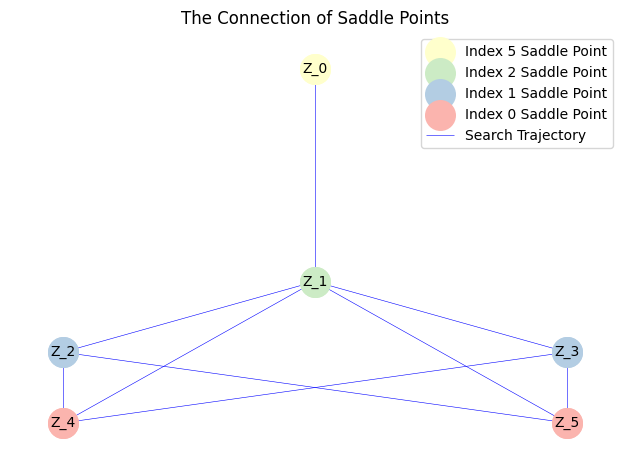
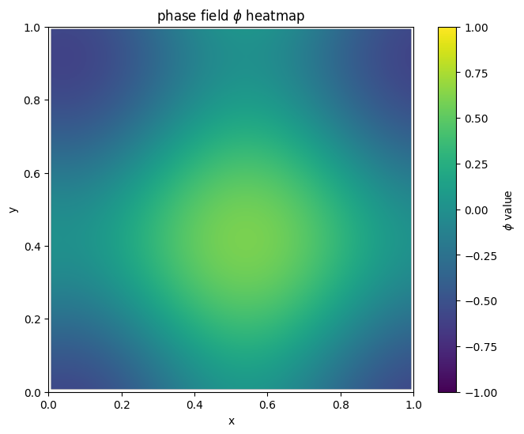
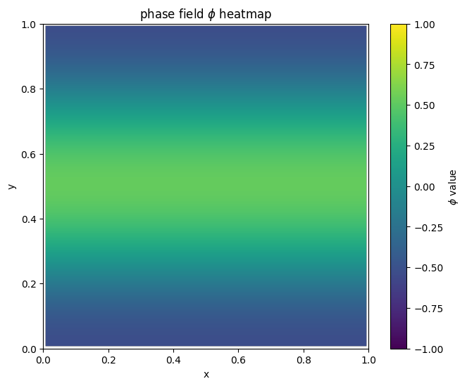
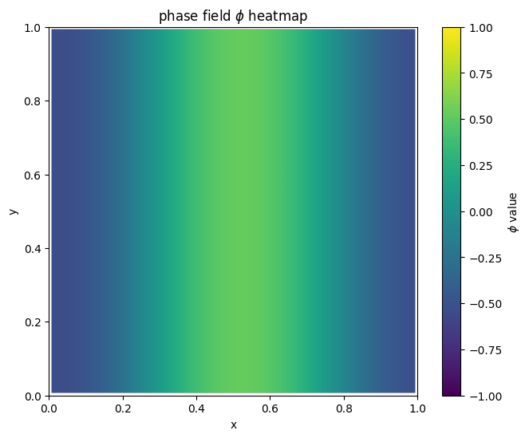
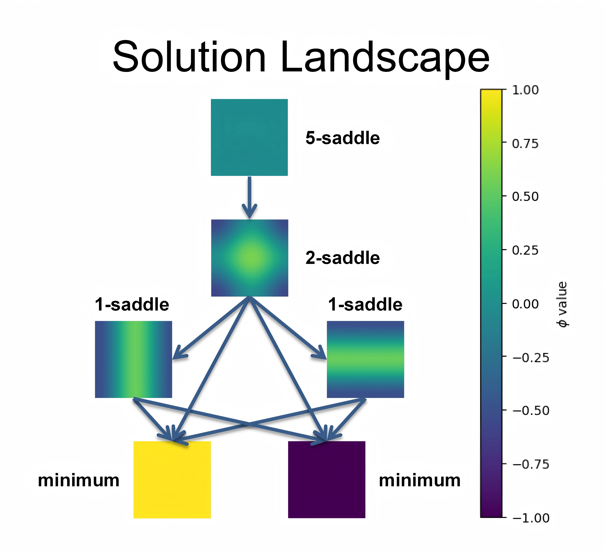
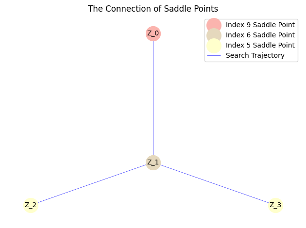
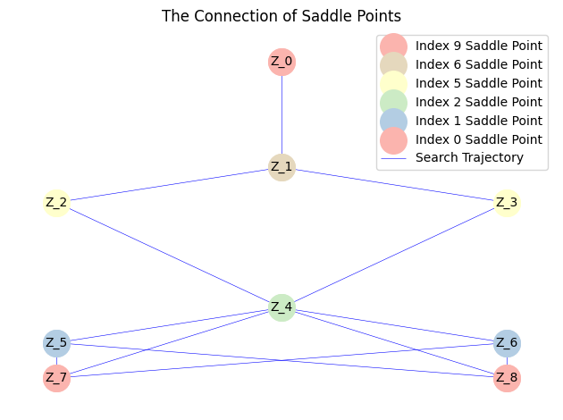
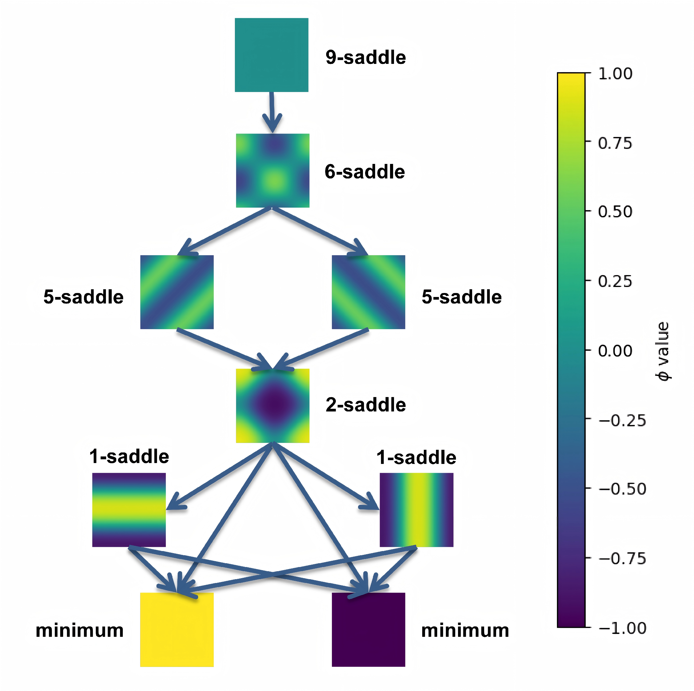

在这个示例中，我们考虑一个二维相场模型：

$$
E(\phi) = \int_{\Omega} \left( \frac{\kappa}{2} |\nabla \phi|^2 + \frac{1}{4} (1 - \phi^2)^2 \right) dx
$$

Allen-Cahn 方程如下：

$$
\dot{\phi} = \kappa \Delta \phi + \phi - \phi^3
$$

我们考虑定义域 $\Omega = [0,1]^{2}$ ，并采用周期性边界条件。 
我们使用有限差分法对其进行离散化，网格划分为 $64 \times 64$。

首先，我们将 `saddlescape-1.0` 目录的路径添加到系统路径中：


```python
import sys
import os

sys.path.append(os.path.abspath(os.path.join(os.getcwd(), '..', 'saddlescape-1.0')))

```

接着，我们导入主类：


```python
from saddlescape import Landscape
import numpy as np

# import packages needed
```

定义能量函数：


```python
from scipy.ndimage import convolve

def gradient_PF(x, opt):
	kappa = opt['kappa']
	n2 = len(x)
	n = int(np.sqrt(n2))
	phi = x.reshape(n, n)
	h = opt['h']

	D2 = np.array([[0, 1, 0],
				   [1, -4, 1],
				   [0, 1, 0]]) / h**2

	conv_term = convolve(phi, D2, mode='wrap')

	F = -(kappa * conv_term + phi - phi**3)

	return F.reshape(n2, 1)

```

接着，我们定义了具有平移不变性的判断函数。


```python
def SameSaddle(x, y):
	n= 64
	A = x.reshape(n,n)
	B = y.reshape(n,n)
	epsilon = 0.05

	row_indices = np.array([(np.arange(n) - dx) % n for dx in range(n)])
	col_indices = np.array([(np.arange(n) - dy) % n for dy in range(n)])

	row_shifted = np.zeros((n, n, n), dtype=B.dtype)
	for dx in range(n):
		row_shifted[dx] = B[row_indices[dx], :]

	for dx in range(n):
		for dy in range(n):
			shifted_B = row_shifted[dx][:, col_indices[dy]]
			max_diff = np.max(np.abs(A - shifted_B))
			if max_diff <= epsilon:
				return True
	return False

```

定义系统参数$\kappa=0.02$.


```python
# parameter initialization
x0 = np.array([0 for i in range(N**2)]) # initial point
dt = 1e-3 # time step
k = 5
acceme = 'nesterov'
neschoice = 1
nesres = 200
mom = 0.8
maxiter = 2000 # max iter
```


```python
MyLandscape = Landscape(MaxIndex=k, AutoDiff=False, Grad=GradFunc, DimerLength=1e-3, 
						HessianDimerLength=1e-3, EigenStepSize=1e-7, InitialPoint=x0, 
						TimeStep=dt, Acceleration=acceme, SearchArea=1e4, SymmetryCheck=False,
						Tolerance=1e-4, MaxIndexGap=3, EigenCombination='min',
						BBStep=True, NesterovChoice=neschoice, NesterovRestart=nesres, 
						Momentum=mom, MaxIter=maxiter, Verbose=True, ReportInterval=10, 
						EigenMaxIter=2, PerturbationNumber=1, EigvecUnified=True,
						SameJudgementMethod=SameSaddle, PerturbationRadius=5.0)
# Instantiation
MyLandscape.Run()
# Calculate
```

    HiSD Solver Configuration:
    ------------------------------
    [HiSD] Current parameters (initialized):
    [Config Sync] `Dim` parameter auto-adjusted to 4096 based on `InitialPoint` dimensionality.
    Parameter `NumericalGrad` not specified - using default value False.
    Parameter `EigenMethod` not specified - using default value lobpcg.
    Parameter `ExactHessian` not specified - using default value False.
    Parameter `PrecisionTol` not specified - using default value 1e-05.
    Parameter 'GradientSystem' not provided. Enabling automatic symmetry detection.
    
    
    Non-gradient system detected. Activating GHiSD algorithm.
    'lobpcg' incompatible with non-gradient systems. Reverting to 'power' method.
    
    
    Landscape Configuration:
    ------------------------------
    [Landscape] Current parameters (initialized):
    Parameter `PerturbationMethod` not specified - using default value uniform.
    Parameter `InitialEigenVectors` not specified - using default value None.
    
    Start running:
    ------------------------------
    
    
    
    From initial point search index-5:
    ------------------------------
    
    
    Non-degenerate saddle point identified: Morse index =5 (number of negative eigenvalues).
    
    
    From saddle point (index-5, ID-0) search index-4:
    ------------------------------
    
    
    Iteration: 10|| Norm of gradient: 2.626117
    Iteration: 20|| Norm of gradient: 2.073056
    Iteration: 30|| Norm of gradient: 1.778669
    Iteration: 40|| Norm of gradient: 1.685068
    Iteration: 50|| Norm of gradient: 1.643202
    Iteration: 60|| Norm of gradient: 4.551244
    Iteration: 70|| Norm of gradient: 2.191489
    Iteration: 80|| Norm of gradient: 1.932887
    Iteration: 90|| Norm of gradient: 1.624164
    Iteration: 100|| Norm of gradient: 1.375257
    Iteration: 110|| Norm of gradient: 1.139303
    Iteration: 120|| Norm of gradient: 0.913087
    Iteration: 130|| Norm of gradient: 0.756791
    Iteration: 140|| Norm of gradient: 0.647716
    Iteration: 150|| Norm of gradient: 0.592122
    Iteration: 160|| Norm of gradient: 0.578698
    Iteration: 170|| Norm of gradient: 0.567598
    Iteration: 180|| Norm of gradient: 0.548581
    Iteration: 190|| Norm of gradient: 0.516373
    Iteration: 200|| Norm of gradient: 0.466288
    Iteration: 210|| Norm of gradient: 0.282131
    Iteration: 220|| Norm of gradient: 0.269620
    Iteration: 230|| Norm of gradient: 0.253248
    Iteration: 240|| Norm of gradient: 0.234388
    Iteration: 250|| Norm of gradient: 0.213168
    Iteration: 260|| Norm of gradient: 0.190388
    Iteration: 270|| Norm of gradient: 0.166994
    Iteration: 280|| Norm of gradient: 0.143766
    Iteration: 290|| Norm of gradient: 0.121361
    Iteration: 300|| Norm of gradient: 0.100343
    Iteration: 310|| Norm of gradient: 0.081218
    Iteration: 320|| Norm of gradient: 0.064524
    Iteration: 330|| Norm of gradient: 0.050891
    Iteration: 340|| Norm of gradient: 0.040991
    Iteration: 350|| Norm of gradient: 0.035177
    Iteration: 360|| Norm of gradient: 0.032834
    Iteration: 370|| Norm of gradient: 0.032392
    Iteration: 380|| Norm of gradient: 0.032298
    Iteration: 390|| Norm of gradient: 0.031682
    Iteration: 400|| Norm of gradient: 0.030207
    Iteration: 410|| Norm of gradient: 0.024279
    Iteration: 420|| Norm of gradient: 0.023424
    Iteration: 430|| Norm of gradient: 0.022173
    Iteration: 440|| Norm of gradient: 0.020657
    Iteration: 450|| Norm of gradient: 0.018927
    Iteration: 460|| Norm of gradient: 0.017052
    Iteration: 470|| Norm of gradient: 0.015098
    Iteration: 480|| Norm of gradient: 0.013126
    Iteration: 490|| Norm of gradient: 0.011190
    Iteration: 500|| Norm of gradient: 0.009342
    Iteration: 510|| Norm of gradient: 0.007631
    Iteration: 520|| Norm of gradient: 0.006112
    Iteration: 530|| Norm of gradient: 0.004849
    Iteration: 540|| Norm of gradient: 0.003910
    Iteration: 550|| Norm of gradient: 0.003333
    Iteration: 560|| Norm of gradient: 0.003077
    Iteration: 570|| Norm of gradient: 0.003009
    Iteration: 580|| Norm of gradient: 0.002989
    Iteration: 590|| Norm of gradient: 0.002935
    Iteration: 600|| Norm of gradient: 0.002811
    Iteration: 610|| Norm of gradient: 0.002310
    Iteration: 620|| Norm of gradient: 0.002230
    Iteration: 630|| Norm of gradient: 0.002112
    Iteration: 640|| Norm of gradient: 0.001969
    Iteration: 650|| Norm of gradient: 0.001805
    Iteration: 660|| Norm of gradient: 0.001626
    Iteration: 670|| Norm of gradient: 0.001440
    Iteration: 680|| Norm of gradient: 0.001251
    Iteration: 690|| Norm of gradient: 0.001065
    Iteration: 700|| Norm of gradient: 0.000888
    Iteration: 710|| Norm of gradient: 0.000724
    Iteration: 720|| Norm of gradient: 0.000579
    Iteration: 730|| Norm of gradient: 0.000460
    Iteration: 740|| Norm of gradient: 0.000371
    Iteration: 750|| Norm of gradient: 0.000317
    Iteration: 760|| Norm of gradient: 0.000293
    Iteration: 770|| Norm of gradient: 0.000286
    Iteration: 780|| Norm of gradient: 0.000283
    Iteration: 790|| Norm of gradient: 0.000278
    Iteration: 800|| Norm of gradient: 0.000266
    Iteration: 810|| Norm of gradient: 0.000218
    Iteration: 820|| Norm of gradient: 0.000211
    Iteration: 830|| Norm of gradient: 0.000200
    Iteration: 840|| Norm of gradient: 0.000186
    Iteration: 850|| Norm of gradient: 0.000171
    Iteration: 860|| Norm of gradient: 0.000154
    Iteration: 870|| Norm of gradient: 0.000137
    Iteration: 880|| Norm of gradient: 0.000119
    Iteration: 890|| Norm of gradient: 0.000101
    [WARNING] Degenerate saddle point detected under precision tol=1e-05: Hessian matrix may contain zero eigenvalue(s).
    Eigenvalue spectrum: negative=2, zero=2, positive=4092. 

......([完整的结果请参考GitHub仓库中的文件](https://github.com/HiSDpackage/saddlescape/blob/main/gallery/Ex_4_PhaseField.ipynb))


我们可以绘制解景观并保存数据。


```python
MyLandscape.DrawConnection()
MyLandscape.Save('output\Ex_PhaseField','mat')
# Save the data
```


    

    


然后，我们可以通过后处理来绘制该函数。


```python
import matplotlib.pyplot as plt
from scipy.interpolate import griddata

def plot_phi_heatmap(phi_vector, N):
    if len(phi_vector) != N * N:
        raise ValueError(f"Input shape must be {N * N}, but got {len(phi_vector)}")
    
    h=1/N

    x = np.linspace(h/2, 1-h/2, N)
    y = np.linspace(h/2, 1-h/2, N)
    X, Y = np.meshgrid(x, y)

    phi = phi_vector.reshape((N, N))

    grid_x, grid_y = np.mgrid[0:1:N*10j, 0:1:N*10j] 
    grid_phi = griddata((X.flatten(), Y.flatten()), phi.flatten(), (grid_x, grid_y), method='cubic')

    # Draw heatmap
    plt.figure(figsize=(8, 6))
    plt.imshow(grid_phi, extent=(0, 1, 0, 1), origin='lower', cmap='viridis',vmin=-1, vmax=1)
    plt.colorbar(label='$\phi$ value')
    plt.title('phase field $\phi$ heatmap')
    plt.xlabel('x')
    plt.ylabel('y')
    plt.show()
```


```python
for i in range(len(MyLandscape.SaddleList)):
    plot_phi_heatmap(MyLandscape.SaddleList[i][1],N)
```


    

    


    

    


    

    


    

    


    

    


    


我们把鞍点相场示意图结合解景观联系起来可以得到：


此外，对于具有更复杂解景观的 $\kappa=0.01$ 系统，我们可以先采用BB步长配合Nesterov加速来快速获取初步的解景观。



然而，由于BB步长在梯度较大区域可能变得过大，导致算法发散和搜索不完整，我们随后使用固定小步长重新启动搜索，以构建完整的解景观。这种先加速后精细搜索的两阶段策略有效平衡了计算效率和解的准确性。通过此方法获得的最终解景观如下：



([完整的结果请参考GitHub仓库中的文件](https://github.com/HiSDpackage/saddlescape/blob/main/gallery/Ex_4_PhaseField-NewKappa.ipynb))

类似上面$\kappa=0.02$的情形我们可以手动绘制如下图形：



另外，我们也可以基于快速傅里叶变换(FFT)的归一化互相关来定义判断函数，并获得相同的结果([Ex_4_PhaseField-NewSameSaddle](https://github.com/HiSDpackage/saddlescape/blob/main/gallery/Ex_4_PhaseField-NewSameSaddle.ipynb),[Ex_4_PhaseField-NewKappa-NewSameSaddle](https://github.com/HiSDpackage/saddlescape/blob/main/gallery/Ex_4_PhaseField-NewKappa-NewSameSaddle.ipynb))。

```python
import numpy as np
from numpy.fft import fft2, ifft2

def SameSaddle(x, y):
    """
    Determine if two solutions are equivalent under periodic translation
    using normalized cross-correlation.
    
    Correctly distinguishes A vs shifted(A) (True) from A vs shifted(-A) (False),
    even for self-antisymmetric cases.
    """
    n = 64
    A = x.reshape(n, n)
    B = y.reshape(n, n)

    # 2D Fourier transforms
    fft_A = fft2(A)
    fft_B = fft2(B)
    
    # Cross-correlation spectrum in frequency domain
    cross_corr_spectrum = np.conj(fft_A) * fft_B
    
    # Inverse transform to real space
    real_space_corr = np.real(ifft2(cross_corr_spectrum))
    
    # Find maximum correlation
    max_corr = np.max(real_space_corr)
    
    # Normalization factor (energy of A)
    norm_factor = np.sum(A**2)
    if norm_factor < 1e-7:
        # Zero field case
        return np.sum(B**2) < 1e-7

    # Normalized peak correlation
    normalized_max_corr = max_corr / norm_factor

    # Threshold for equivalence
    if normalized_max_corr > 0.99:
        return True
    
    return False
```

    


    

